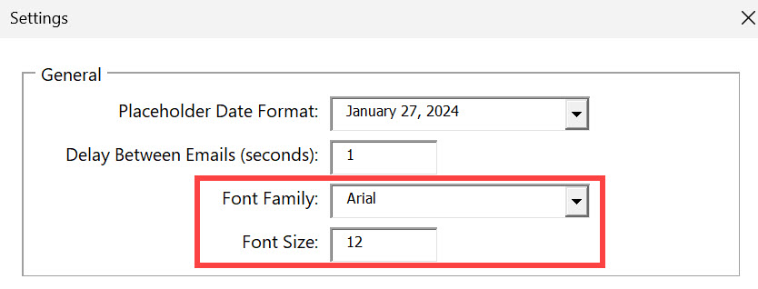
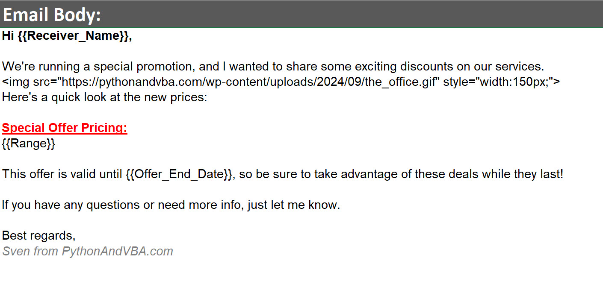
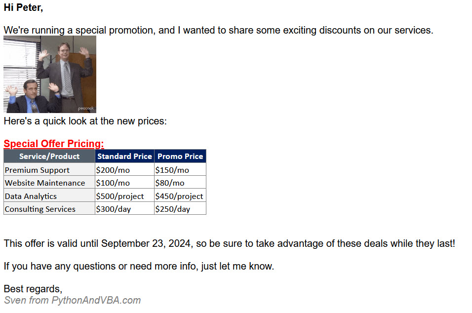

# Email Composition

You can write your email content directly in the **EMAIL\_BODY** sheet of Excel. Here’s how:

* **Excel Formatting**: You can use the normal Excel formatting options like:
  * Bold
  * Italics
  * Underline
  * Text color
* **New Line**: To insert a new line in the cell, press `Alt + Enter`.


The **font family** and **font size** should be set in the **SETTINGS** sheet



***

#### Optional HTML Tags

If you want more control over your email’s layout, you can use **HTML tags** in the email body. Some common HTML tags you can use:

* `
`: Paragraph
* `<strong>`: Bold text
* `<em>`: Italic text
* `<u>`: Underlined text
* ``: Insert an image

***

#### Example Email

Here’s an example of an email with placeholders and an image (or in this case a gif):

<figure><figcaption>
What you input in the Gmail Blaster
</figcaption></figure> <figure><figcaption>
What the receiver will see
</figcaption></figure>

